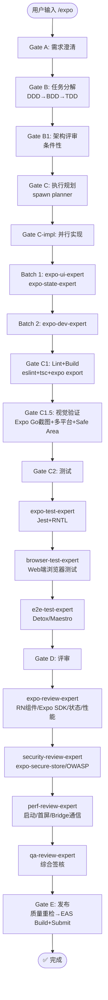

# `/expo` — Expo (React Native) 跨端开发生命周期

- **命令**：`/expo [需求描述]`
- **类别**：平台开发
- **说明**：Expo 生态下 React Native 跨端应用完整开发生命周期，EAS Build + OTA 热更新，零原生配置。

## 使用场景
| 场景 | 说明 |
|------|------|
| Expo 项目开发 | 基于 Expo SDK 的 React Native 应用开发 |
| 现有 Expo 项目迭代 | 功能新增、Bug 修复、组件重构 |
| EAS Build 云端构建 | 无需本地原生环境的云端打包 |
| OTA 热更新 | JavaScript Bundle 级别热修复 |
| 多平台发布准备 | EAS Submit 一键提交 App Store + Google Play |

## 关键 Agent
| Agent | 职责 |
|-------|------|
| expo-dev-expert | Expo SDK 业务逻辑、架构实现 |
| expo-ui-expert | RN 组件 + Expo UI 组件库 |
| expo-state-expert | 状态管理（Zustand/Jotai） |
| expo-test-expert | Jest + RNTL 组件测试 |
| expo-review-expert | RN 组件/Expo SDK/状态/性能评审 |
| e2e-test-expert | Detox/Maestro 端到端测试 |
| security-review-expert | expo-secure-store/OWASP 安全审查 |
| perf-review-expert | 启动/首屏/Bridge 通信性能分析 |
| qa-review-expert | 综合质量签核 |
| infra-deploy-expert | EAS Build + Submit 发布 |

## 流程图

