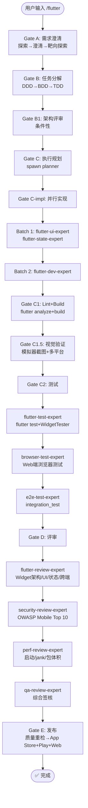

# `/flutter` — Flutter 跨端开发生命周期

- **命令**：`/flutter [需求描述]`
- **类别**：平台开发
- **说明**：Flutter 跨端应用完整开发生命周期，Dart + Widget 体系，一套代码覆盖 iOS/Android/Web/Desktop。

## 使用场景
| 场景 | 说明 |
|------|------|
| 跨端应用开发 | 一套代码同时覆盖 iOS、Android、Web、Desktop |
| 现有 Flutter 项目迭代 | 功能新增、Bug 修复、Widget 重构 |
| 自定义 UI 组件开发 | 高度定制化的 Widget、动画、手势 |
| Flutter 性能优化 | 启动速度、jank 消除、包体积优化 |
| 多平台发布准备 | App Store + Google Play + Web 一键发布 |

## 关键 Agent
| Agent | 职责 |
|-------|------|
| flutter-dev-expert | Dart 业务逻辑、架构实现 |
| flutter-ui-expert | Widget 体系、Material/Cupertino 设计 |
| flutter-state-expert | Riverpod/Bloc 状态管理 |
| flutter-test-expert | flutter test + WidgetTester 测试 |
| flutter-review-expert | Widget 架构/UI/状态/跨端评审 |
| e2e-test-expert | integration_test 端到端测试 |
| security-review-expert | OWASP Mobile Top 10 安全审查 |
| perf-review-expert | 启动/jank/包体积性能分析 |
| qa-review-expert | 综合质量签核 |
| infra-deploy-expert | CI/CD 与多平台发布 |

## 流程图

