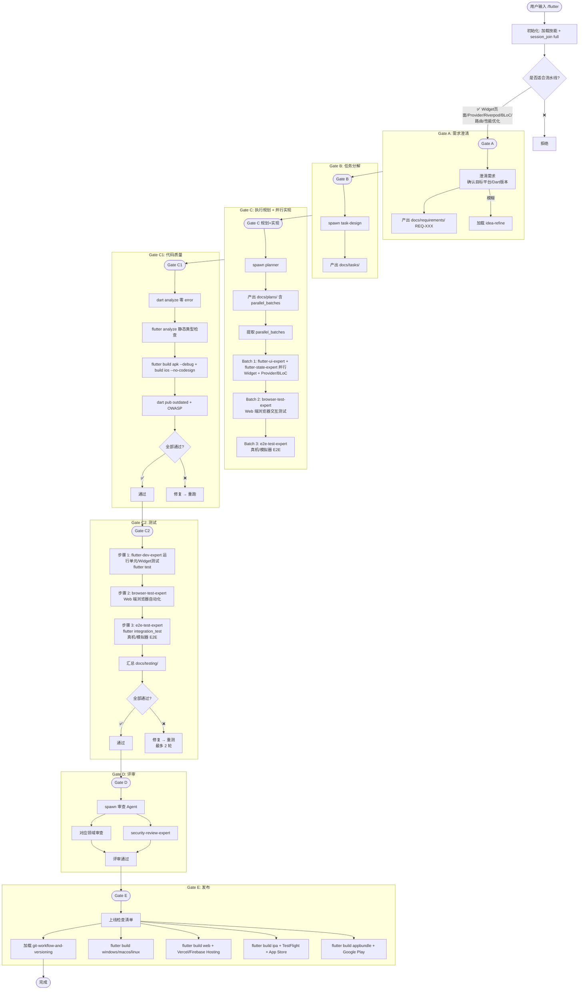

# `/flutter` Flutter 跨端开发生命周期流程图

> **pipeline_type**: `full`  
> **Gate 序列**: A → B → C → C1 → C2 → D → E (7 道闸门)

**Flutter Agent 路由：**

| 层级 | subagent_type |
|------|--------------|
| 全栈实现 | flutter-dev-expert |
| UI/Widget/主题 | flutter-ui-expert |
| 状态/数据/路由 | flutter-state-expert |
| 浏览器测试 Web | browser-test-expert |
| E2E 测试 | e2e-test-expert |
