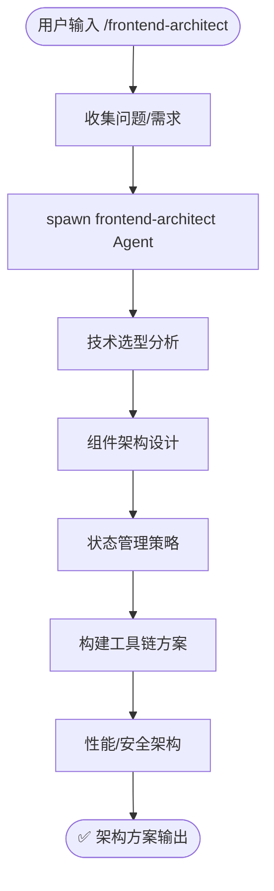

# `/frontend-architect` — 前端架构评审

- **命令**：`/frontend-architect [架构需求描述]`
- **类别**：架构
- **说明**：对前端项目进行架构评审，输出技术选型、组件架构、状态管理与构建工具链等完整方案。

## 使用场景

| 场景 | 说明 |
|------|------|
| 技术栈选型 | 新项目启动时，评估框架（React/Vue/Svelte 等）与配套工具链 |
| 组件架构设计 | 设计组件分层、复用策略、设计系统与组件库方案 |
| 状态管理策略 | 选型并设计全局状态方案（Redux/Zustand/Pinia 等），规划状态分层 |
| 构建工具链优化 | 评估打包工具（Vite/Webpack/Turbopack）、CI 集成与产物优化策略 |
| 性能与安全架构 | 制定首屏加载、懒加载、SSR/SSG 策略及前端安全防护方案 |

## 关键 Agent

| Agent | 职责 |
|-------|------|
| `frontend-architect` | 前端架构整体方案设计，包括技术选型、组件体系与性能优化 |

## 流程图

