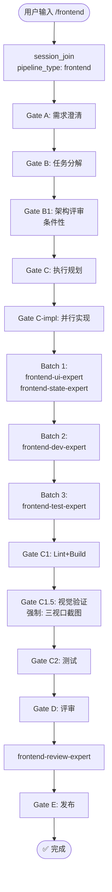

# `/frontend` — 前端开发生命周期

- **命令**：`/frontend [需求描述]`
- **类别**：开发流程
- **说明**：前端开发全生命周期流程，从需求澄清到发布上线，涵盖 UI 实现、状态管理、视觉验证、测试和代码评审各阶段。

## 使用场景
| 场景 | 说明 |
|------|------|
| 新建前端页面 | 从零构建页面组件、布局、交互逻辑 |
| 前端模块扩展 | 在现有前端架构上增加新功能模块或页面 |
| UI 组件开发 | 设计并实现可复用的 UI 组件库 |
| 前端整体交付 | 需要完整走完架构→实现→视觉验证→测试→评审→发布流程 |

## 关键 Agent
| Agent | 职责 |
|-------|------|
| frontend-architect | 前端架构设计与技术选型 |
| frontend-dev-expert | 前端核心业务代码实现 |
| frontend-ui-expert | UI 组件与样式实现 |
| frontend-state-expert | 状态管理方案设计与实现 |
| frontend-test-expert | 前端单元测试与 E2E 测试 |
| frontend-review-expert | 前端代码质量评审 |

## 流程图

