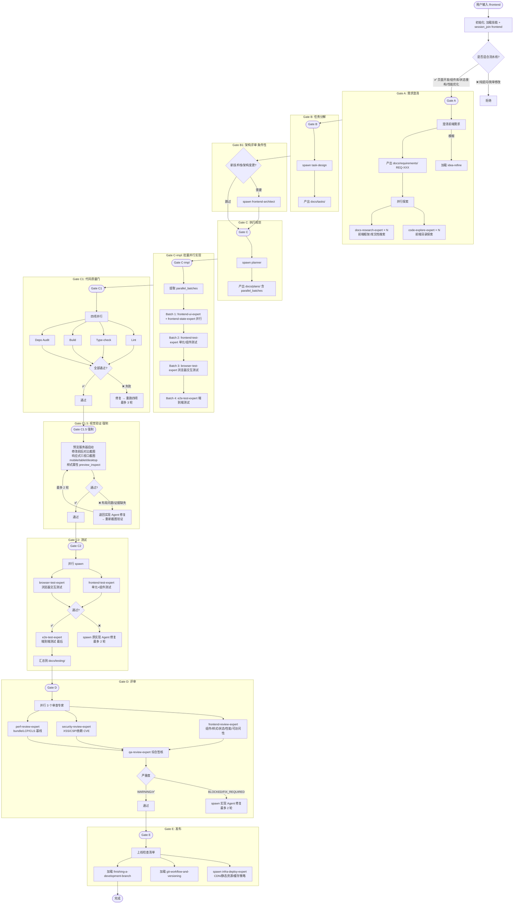

# `/frontend` 前端开发生命周期流程图

> **pipeline_type**: `frontend`  
> **Gate 序列**: A → B → B1 → C → C-impl → C1 → C1.5 → C2 → D → E (10 道闸门, C1.5 强制)

**可用 Agent 路由：**

| 层级 | subagent_type |
|------|--------------|
| 架构设计 | frontend-architect |
| 全栈实现 | frontend-dev-expert |
| UI/布局/样式 | frontend-ui-expert |
| 状态/数据/路由 | frontend-state-expert |
| 前端测试 | frontend-test-expert |
| 浏览器测试 | browser-test-expert |
| E2E 测试 | e2e-test-expert |
| 性能审计 | perf-review-expert |
| 安全审计 | security-review-expert |
