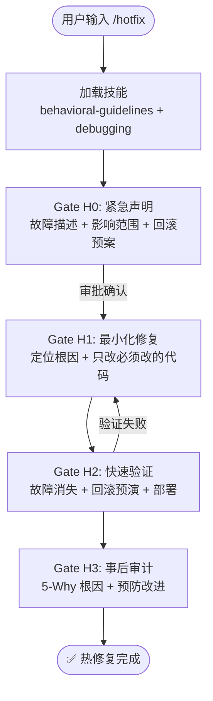

# `/hotfix` — 紧急热修复

- **命令**：`/hotfix [故障描述]`
- **类别**：应急流程
- **说明**：紧急热修复流程，面向线上故障的快速响应，强调最小化修改、快速验证和事后审计，包含回滚预案和 5-Why 根因分析。

## 使用场景
| 场景 | 说明 |
|------|------|
| 线上故障紧急修复 | 生产环境出现严重 Bug，需要立即修复 |
| 安全漏洞应急 | 发现安全漏洞需要紧急修补 |
| 数据异常修复 | 线上数据损坏或异常需要紧急处理 |
| 服务降级应对 | 依赖服务故障需要临时降级方案 |

## 关键 Agent
| Agent | 职责 |
|-------|------|
| code-explore-expert | 快速定位故障根因 |
| frontend-dev-expert | 前端故障修复实现（按需） |
| backend-dev-expert | 后端故障修复实现（按需） |
| remediation-expert | 事后审计与预防改进方案 |

## 流程图

