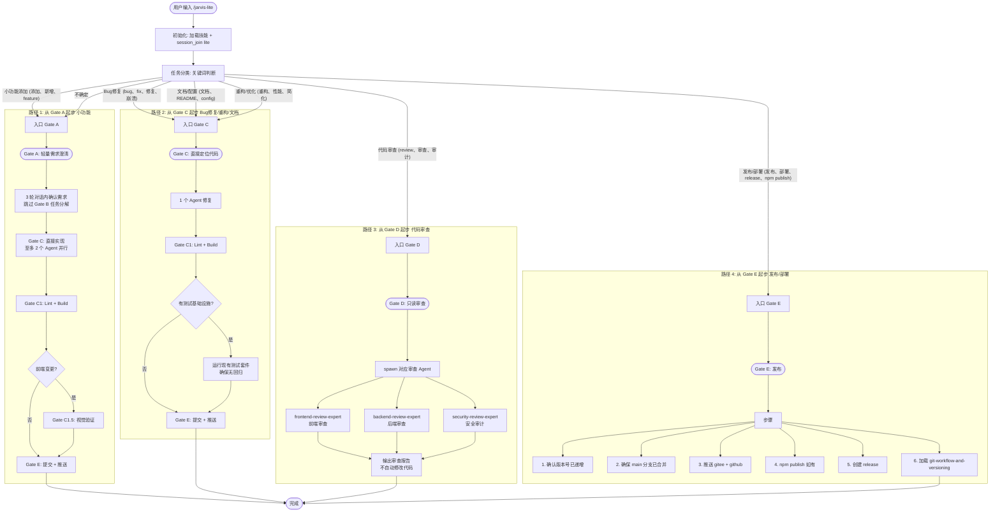

# `/jarvis-lite` 轻量编排流程图

> **pipeline_type**: `lite` —— 按任务类型智能映射 Gate 入口, 跳过无关闸门

**与 `/jarvis` 的区别：**

| 维度 | `/jarvis` | `/jarvis-lite` |
|------|----------|----------------|
| Gate 序列 | A→B→B1→C→C-impl→C1→C1.5→C2→D→E 全部 | 按任务类型跳过无关 Gate |
| 需求文档 | 必须 | 从 Gate A 起步时可选 |
| 任务分解 | 必须 spawn task-design | 跳过 |
| 架构评审 | 条件性必须 | 仅新技术栈时触发 |
| 实现 Agent | 按 parallel_batches 批量 | 至多 2 个 Agent 并行 |
| 测试 | 强制 Gate C2 | 条件性——有测试基础设施则运行 |
| 审查 | 强制 Gate D | 仅 Bug 修复/重构需要 |
