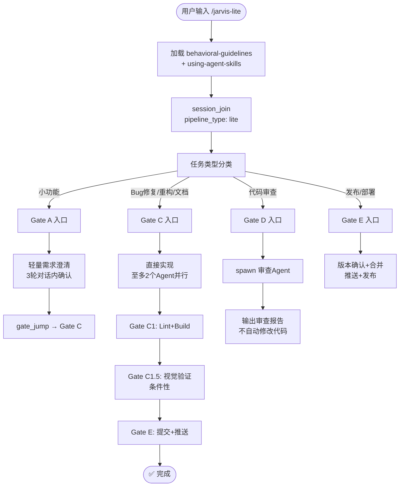

# `/jarvis-lite` — 轻量编排流程图

```mermaid
flowchart TD
    START([用户输入 /jarvis-lite]) --> LOAD[加载 behavioral-guidelines<br/>+ using-agent-skills]
    LOAD --> JOIN[session_join<br/>pipeline_type: lite]
    JOIN --> CLASS[任务类型分类]

    CLASS --> |发布/部署| GE[Gate E 入口]
    CLASS --> |Bug修复/重构/文档| GC[Gate C 入口]
    CLASS --> |代码审查| GD[Gate D 入口]
    CLASS --> |小功能| GA[Gate A 入口]

    GA --> GA1[轻量需求澄清<br/>3轮对话内确认]
    GA1 --> GA2[gate_jump → Gate C]

    GC --> GC1[直接实现<br/>至多2个Agent并行]
    GC1 --> C1[Gate C1: Lint+Build]

    GD --> GD1[spawn 审查Agent]
    GD1 --> GD2[输出审查报告<br/>不自动修改代码]

    GE --> GE1[版本确认+合并<br/>推送+发布]

    C1 --> C15[Gate C1.5: 视觉验证<br/>条件性]
    C15 --> E[Gate E: 提交+推送]
    E --> DONE([✅ 完成])
```
