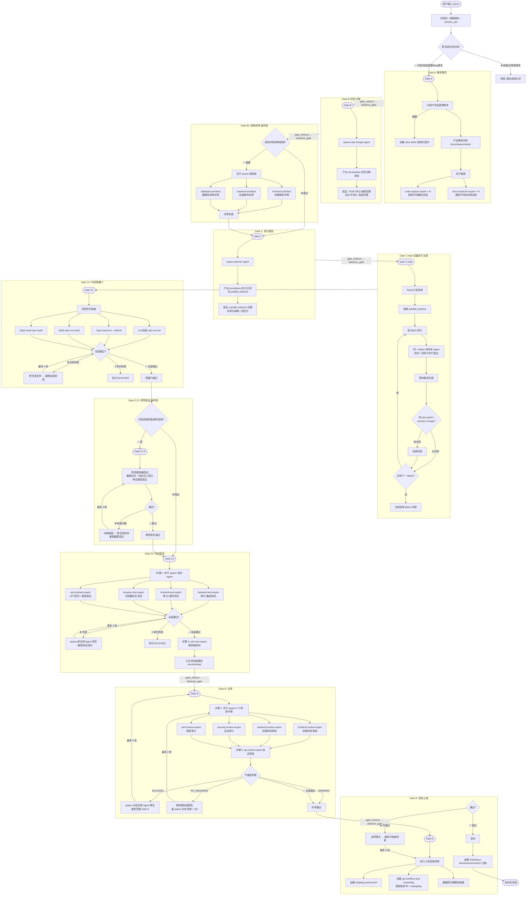

# `/jarvis` 全流程编排流程图

> **pipeline_type**: `full`  
> **Gate 序列**: A → B → B1 → C → C-impl → C1 → C1.5 → C2 → D → E (10 道闸门)

**关键 Agent spawn 关系：**

| Gate | Spawn 模式 | 并行/串行 |
|------|-----------|----------|
| Gate A 通过后 | code-explore-expert × N + docs-research-expert × N | 并行 |
| Gate B | task-design (单 Agent) | 串行 |
| Gate B1 | frontend-architect + backend-architect + database-architect | 并行 |
| Gate C | planner (单 Agent) | 串行 |
| Gate C-impl | 按 parallel_batches 批量, 同 Batch 内并行 | Batch 内并行, Batch 间串行 |
| Gate C1 | Lint + Type-check + Build + Deps Audit | 并行 |
| Gate C2 | backend-test + frontend-test + browser-test + api-contract | 并行 → e2e-test 串行 |
| Gate D | 4 领域审查专家 → qa-review-expert | 并行 → 串行 |
| Gate E | 上线检查清单 + shipping-and-launch | 串行 |
