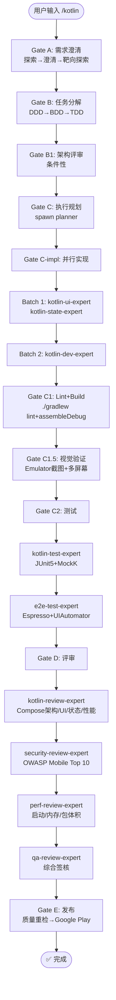

# `/kotlin` — Android 原生开发生命周期

- **命令**：`/kotlin [需求描述]`
- **类别**：框架开发
- **说明**：Android 原生应用完整开发生命周期，Kotlin + Compose/Material3，C1.5 视觉验证强制。

## 使用场景
| 场景 | 说明 |
|------|------|
| 原生 Android 应用开发 | 从零构建 Android 应用，Kotlin + Jetpack Compose |
| 现有 Android 项目迭代 | 功能新增、Bug 修复、UI 重构 |
| Material3 设计规范实现 | Material You 动态主题、自适应布局 |
| Android 性能优化 | 启动速度、内存、包体积优化 |
| Google Play 发布准备 | 签名、审核、上架全流程 |

## 关键 Agent
| Agent | 职责 |
|-------|------|
| kotlin-dev-expert | Kotlin/Compose 业务逻辑、架构实现 |
| kotlin-ui-expert | Compose UI 组件、Material3 设计系统 |
| kotlin-state-expert | ViewModel/StateFlow 状态管理 |
| kotlin-test-expert | JUnit5 + MockK 单元测试 |
| kotlin-review-expert | Compose 架构/UI/状态/性能评审 |
| e2e-test-expert | Espresso + UIAutomator 端到端测试 |
| security-review-expert | OWASP Mobile Top 10 安全审查 |
| perf-review-expert | 启动/内存/包体积性能分析 |
| qa-review-expert | 综合质量签核 |
| infra-deploy-expert | CI/CD 与 Google Play 发布 |

## 质量工具链
- **Lint**: ./gradlew lint
- **Build**: ./gradlew assembleDebug
- **Test**: JUnit5 + MockK
- **Preview**: Compose Preview + Emulator

## 流程图

