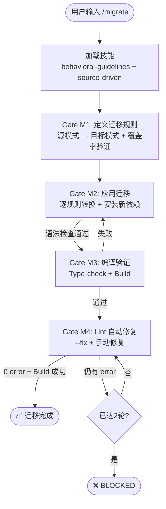

# `/migrate` — 代码迁移升级

- **命令**：`/migrate [迁移目标描述]`
- **类别**：工程
- **说明**：执行系统化的代码迁移，从源模式逐步转换到目标模式，包含依赖安装、编译验证与 Lint 修复闭环。

## 使用场景

| 场景 | 说明 |
|------|------|
| 框架版本升级 | 大版本升级（如 Angular 15→17、Next.js 13→14），含 API 变更适配 |
| 语言/运行时迁移 | 如 JavaScript→TypeScript、CommonJS→ESM 的系统化转换 |
| UI 库替换 | 从一个 UI 组件库迁移到另一个（如 Material UI→Ant Design） |
| API 协议迁移 | REST→GraphQL、HTTP→gRPC 等接口协议的批量转换 |
| 构建工具迁移 | Webpack→Vite、Jest→Vitest 等工具链的迁移与配置适配 |

## 关键 Agent

| Agent | 职责 |
|-------|------|
| `code-explore-expert` | 分析现有代码结构，识别需要迁移的模式与边界 |
| `planner` | 制定迁移计划，拆分迁移批次与回滚策略 |
| `backend-dev-expert` | 后端代码迁移实现，处理 API 与服务层变更 |
| `frontend-dev-expert` | 前端代码迁移实现，处理组件、样式与交互层变更 |

## 流程图

