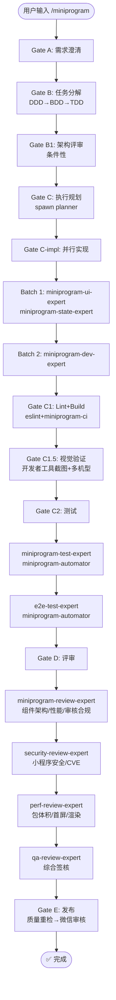

# `/miniprogram` — 微信小程序原生开发生命周期

- **命令**：`/miniprogram [需求描述]`
- **类别**：框架开发
- **说明**：微信小程序原生开发完整生命周期，WXML + WXSS + WXS，C1.5 视觉验证强制。

## 使用场景
| 场景 | 说明 |
|------|------|
| 微信小程序开发 | 从零构建微信小程序，原生 WXML/WXSS/WXS |
| 现有小程序迭代 | 功能新增、Bug 修复、组件重构 |
| 小程序性能优化 | 包体积、首屏渲染、分包加载优化 |
| 微信 Open API 集成 | 支付、登录、分享等微信原生能力 |
| 小程序发布准备 | 微信审核 + 体验版管理 |

## 关键 Agent
| Agent | 职责 |
|-------|------|
| miniprogram-dev-expert | 小程序业务逻辑、架构实现 |
| miniprogram-ui-expert | WXML/WXSS 组件、WeUI 设计系统 |
| miniprogram-state-expert | 全局状态管理（MobX/Redux） |
| miniprogram-test-expert | miniprogram-automator 测试 |
| miniprogram-review-expert | 组件架构/性能/审核合规评审 |
| e2e-test-expert | miniprogram-automator 端到端测试 |
| security-review-expert | 小程序安全/CVE 安全审查 |
| perf-review-expert | 包体积/首屏/渲染性能分析 |
| qa-review-expert | 综合质量签核 |
| infra-deploy-expert | 微信审核 + CI/CD 发布 |

## 质量工具链
- **Lint**: eslint + wxlint
- **Build**: miniprogram-ci
- **Test**: miniprogram-automator + Jest
- **Preview**: 微信开发者工具

## 流程图

