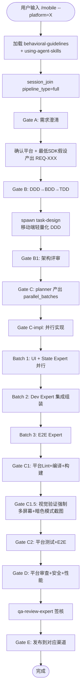

# `/mobile` — 移动端开发生命周期

- **命令**：`/mobile --platform=<name> [需求描述]`
- **类别**：平台开发
- **说明**：统一移动端编排器，通过 `--platform` 参数支持 6 个平台（android/ios/flutter/expo/react-native/taro）的完整开发生命周期。

## 使用场景

| 场景 | platform | 适用 |
|------|----------|------|
| 原生 Android 开发 | `android` | Kotlin + Compose/Material3 |
| 原生 iOS 开发 | `ios` | Swift + SwiftUI/HIG |
| 跨端 Flutter 开发 | `flutter` | Dart + Widget/Provider/Riverpod |
| Expo 跨端开发 | `expo` | TypeScript + Expo SDK 52 |
| React Native 跨端 | `react-native` | TypeScript + RN 0.76 |
| Taro 小程序跨端 | `taro` | TypeScript + Taro 4.x |

## 流程步骤

1. **加载技能 + 注册引擎**：`Skill("behavioral-guidelines")` + `session_join(pipeline_type: "full")`
2. **Gate A — 需求澄清**：确认平台 + 最低 SDK 假设，产出 REQ-XXX 需求文档
3. **Gate B — 任务分解**：DDD→BDD→TDD（移动端可轻量化，单轮 DDD 分析即可）
4. **Gate B1 — 架构评审**：spawn 对应平台架构师
5. **Gate C→C-impl — 并行实现**：planner 规划 → Batch spawn 平台 Agent（UI+State 并行 → Dev 集成 → E2E 测试）
6. **Gate C1 → C1.5 — 质量+视觉**：平台特定 Lint/编译/构建 + **视觉验证强制**（多屏幕尺寸+暗色模式截图）
7. **Gate C2 → D → E — 测试+评审+发布**：spawn 平台测试/审查/安全/性能 Agent → QA 签核 → 发布到对应渠道

## 关键 Agent（按平台路由）

| 层级 | Agent 模式 | 示例（android） |
|------|-----------|----------------|
| 实现 | `{platform}-dev-expert` | android-dev-expert |
| UI | `{platform}-ui-expert` | android-ui-expert |
| 状态 | `{platform}-state-expert` | android-state-expert |
| 测试 | `{platform}-test-expert` | android-test-expert |
| 审查 | `{platform}-review-expert` | android-review-expert |
| E2E | `e2e-test-expert` | (共享) |
| 安全 | `security-review-expert` | (共享) |
| 性能 | `perf-review-expert` | (共享) |
| QA 签核 | `qa-review-expert` | (共享) |
| 部署 | `infra-deploy-expert` | (共享) |

