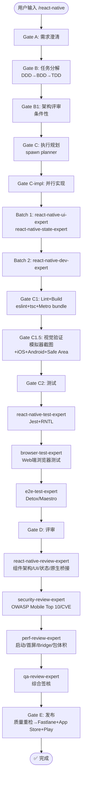

# `/react-native` — React Native 跨端开发生命周期

- **命令**：`/react-native [需求描述]`
- **类别**：平台开发
- **说明**：React Native 跨端应用完整开发生命周期，JSX + Native Modules，一套代码覆盖 iOS + Android。

## 使用场景
| 场景 | 说明 |
|------|------|
| React Native 应用开发 | 从零构建跨端移动应用 |
| 现有 RN 项目迭代 | 功能新增、Bug 修复、组件重构 |
| 原生模块桥接 | Native Module / Turbo Module 集成 |
| RN 性能优化 | 启动速度、首屏、Bridge 通信、包体积优化 |
| 多平台发布准备 | Fastlane + App Store + Google Play |

## 关键 Agent
| Agent | 职责 |
|-------|------|
| react-native-dev-expert | RN 业务逻辑、架构实现 |
| react-native-ui-expert | RN 组件、跨端 UI 适配 |
| react-native-state-expert | 状态管理（Redux/Zustand） |
| react-native-test-expert | Jest + RNTL 组件测试 |
| react-native-review-expert | 组件架构/UI/状态/原生桥接评审 |
| e2e-test-expert | Detox/Maestro 端到端测试 |
| security-review-expert | OWASP Mobile Top 10 安全审查 |
| perf-review-expert | 启动/首屏/Bridge/包体积性能分析 |
| qa-review-expert | 综合质量签核 |
| infra-deploy-expert | Fastlane + App Store + Play 发布 |

## 流程图

