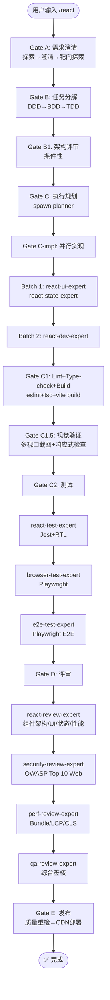

# `/react` — React Web 开发生命周期

- **命令**：`/react [需求描述]`
- **类别**：框架开发
- **说明**：React Web 应用完整开发生命周期，React 18+ + TypeScript，C1.5 视觉验证强制。

## 使用场景
| 场景 | 说明 |
|------|------|
| React SPA 开发 | 从零构建 React 单页应用 |
| 现有 React 项目迭代 | 功能新增、Bug 修复、组件重构 |
| React 组件库开发 | 高度可复用的 React 组件 |
| React 性能优化 | 渲染优化、bundle 分析、Lighthouse |
| 前端发布准备 | 构建优化 + CDN 部署 |

## 关键 Agent
| Agent | 职责 |
|-------|------|
| react-dev-expert | React 业务逻辑、架构实现 |
| react-ui-expert | React 组件、CSS/animation 设计 |
| react-state-expert | Redux/Zustand/Jotai 状态管理 |
| react-test-expert | Jest + RTL 组件测试 |
| react-review-expert | 组件架构/UI/状态/性能评审 |
| browser-test-expert | Playwright 浏览器交互测试 |
| e2e-test-expert | Playwright 端到端测试 |
| security-review-expert | OWASP Top 10 Web 安全审查 |
| perf-review-expert | Bundle/LCP/CLS 性能分析 |
| qa-review-expert | 综合质量签核 |
| infra-deploy-expert | CI/CD 前端部署 |

## 质量工具链
- **Lint**: eslint
- **Type-check**: tsc --noEmit
- **Build**: vite build / webpack
- **Test**: Jest + React Testing Library

## 流程图

