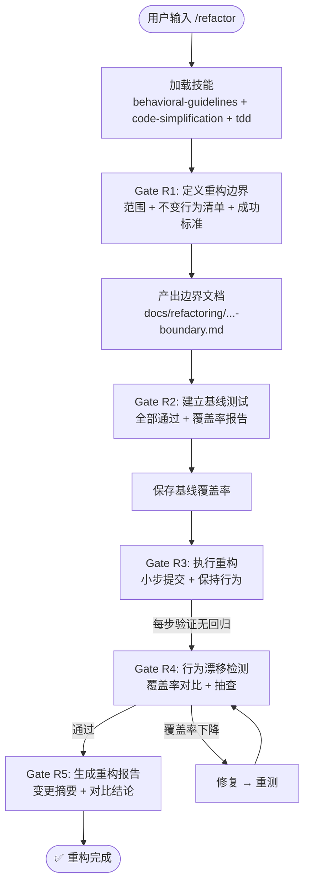

# `/refactor` — 重构安全网流程图

```mermaid
flowchart TD
    START([用户输入 /refactor]) --> S0[加载技能<br/>behavioral-guidelines + code-simplification + tdd]
    S0 --> R1[Gate R1: 定义重构边界<br/>范围 + 不变行为清单 + 成功标准]
    R1 --> R1D[产出边界文档<br/>docs/refactoring/...-boundary.md]
    R1D --> R2[Gate R2: 建立基线测试<br/>全部通过 + 覆盖率报告]
    R2 --> R2D[保存基线覆盖率]
    R2D --> R3[Gate R3: 执行重构<br/>小步提交 + 保持行为]
    R3 --> |每步验证无回归| R4[Gate R4: 行为漂移检测<br/>覆盖率对比 + 抽查]
    R4 --> |通过| R5[Gate R5: 生成重构报告<br/>变更摘要 + 对比结论]
    R5 --> DONE([✅ 重构完成])
    R4 --> |覆盖率下降| FIX[修复 → 重测]
    FIX --> R4
```
