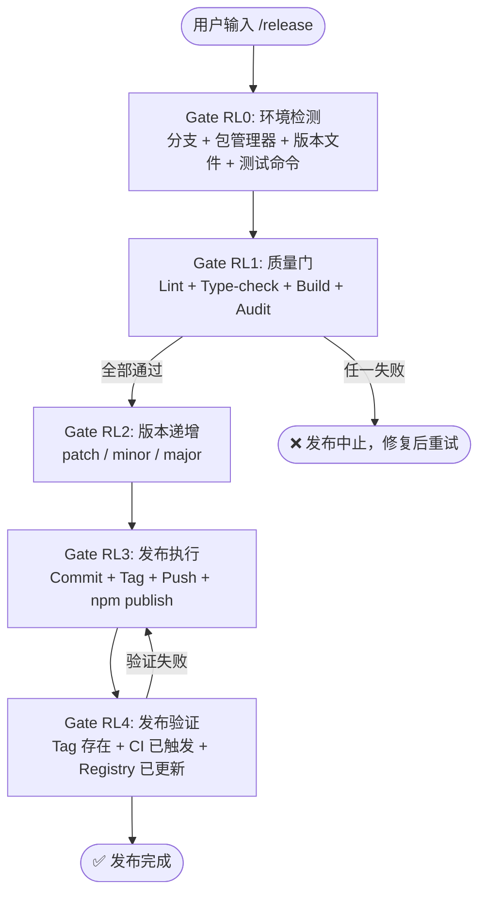

# `/release` — 版本发布流程

- **命令**：`/release [版本类型或描述]`
- **类别**：发布
- **说明**：执行完整的版本发布流程，包含环境检测、质量门禁、版本递增、发布执行与发布验证五阶段闭环。

## 使用场景

| 场景 | 说明 |
|------|------|
| 常规版本发布 | patch/minor/major 版本递增，含质量门禁与 npm publish |
| 热急发布 | 紧急修复后的快速 patch 发布，跳过非关键检查 |
| 首次发布 | 新包首次发布到 npm，含 registry 配置与权限验证 |
| 发布回滚 | 发布验证失败时，回退版本号与 Tag 并中止发布 |

## 关键 Agent

| Agent | 职责 |
|-------|------|
| `infra-deploy-expert` | 基础设施与部署操作，包括 Git 操作、npm publish 与 CI 触发 |
| `qa-review-expert` | 发布前质量审查，包括 Lint、Type-check、Build 与安全审计 |

## 流程图

