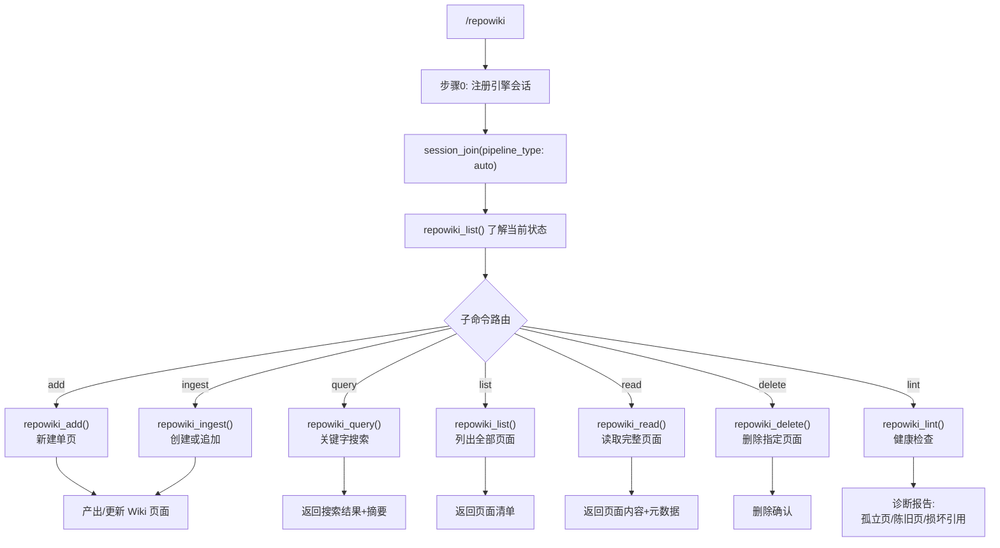

# `/repowiki` — 项目知识库

> 持久化项目知识库，支持增/查/改/删/健康检查。存储到 `.jarvis/wiki/pages/`

## 子命令

| 子命令 | 引擎工具 | 说明 |
|--------|---------|------|
| `add` | `repowiki_add` | 创建单页，slug 重复则拒绝 |
| `ingest` | `repowiki_ingest` | 创建或追加（合并模式），带时间戳 |
| `query` | `repowiki_query` | 纯文本+标签搜索 |
| `list` | `repowiki_list` | 列出所有页面，支持按项目过滤 |
| `read` | `repowiki_read` | 读取完整页面含 frontmatter |
| `delete` | `repowiki_delete` | 不可逆删除 |
| `lint` | `repowiki_lint` | 健康检查：孤立/陈旧/损坏/超大/低置信度 |
