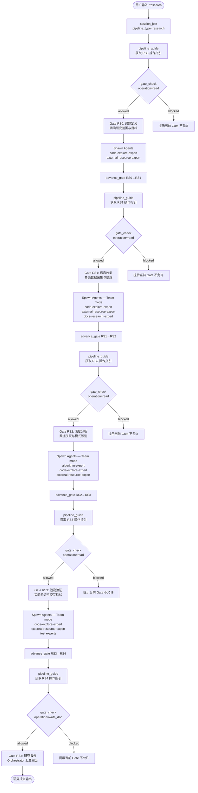

# `/research` — 深度研究

- **命令**：`/research [研究课题描述]`
- **类别**：调研
- **说明**：五阶段深度研究流程（课题定义→信息收集→深度分析→假设验证→研究报告），通过多 Agent 协作产出高质量研究报告。

## 使用场景

| 场景 | 说明 |
|------|------|
| 技术可行性调研 | 评估新技术/新框架的成熟度、适用场景与集成成本 |
| 竞品深度分析 | 系统化分析竞品架构、功能实现与技术路线 |
| 学术/工业前沿追踪 | 调研论文、开源项目或行业最佳实践，提炼可落地方案 |
| 架构决策支撑 | 为重大技术决策（如数据库选型、部署架构）提供数据驱动的调研报告 |
| 安全漏洞研究 | 调研特定 CVE 或攻击面，评估影响范围与修复策略 |

## 关键 Agent

| Agent | 职责 |
|-------|------|
| `code-explore-expert` | 代码库内调研，分析现有实现与技术债 |
| `external-resource-expert` | 外部资源整合，获取官方文档、论文与基准数据 |
| `docs-research-expert` | 文档与知识库调研，整理技术规范与历史决策记录 |
| `algorithm-expert` | 算法与理论分析，评估算法复杂度与优化空间 |

## 流程图

