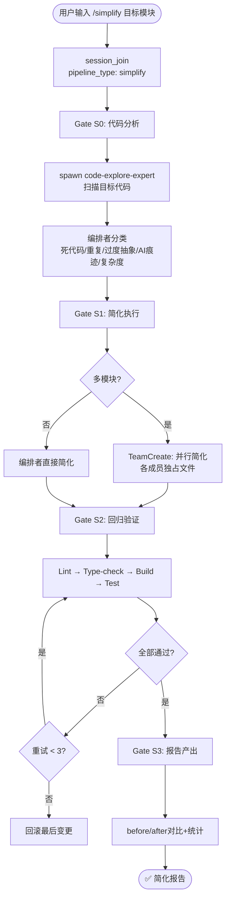

# `/simplify` — 代码简化

- **命令**：`/simplify [目标模块]`
- **类别**：质量流程
- **说明**：代码简化流程，自动识别死代码、重复逻辑、过度抽象和 AI 痕迹，通过回归验证确保简化后功能不变，支持多模块并行简化。

## 使用场景
| 场景 | 说明 |
|------|------|
| 消除死代码 | 移除未使用的函数、变量、导入和模块 |
| 合并重复逻辑 | 将分散在多处的相似代码抽取为公共函数 |
| 降低过度抽象 | 移除不必要的中间层、泛化和工厂模式 |
| 清理 AI 痕迹 | 移除 AI 生成代码中的冗余注释和过度防御性编程 |

## 关键 Agent
| Agent | 职责 |
|-------|------|
| code-explore-expert | 代码扫描与问题分类 |
| planner | 简化策略制定与优先级排序 |
| backend-dev-expert | 后端代码简化实现（按需） |
| frontend-dev-expert | 前端代码简化实现（按需） |

## 流程图

