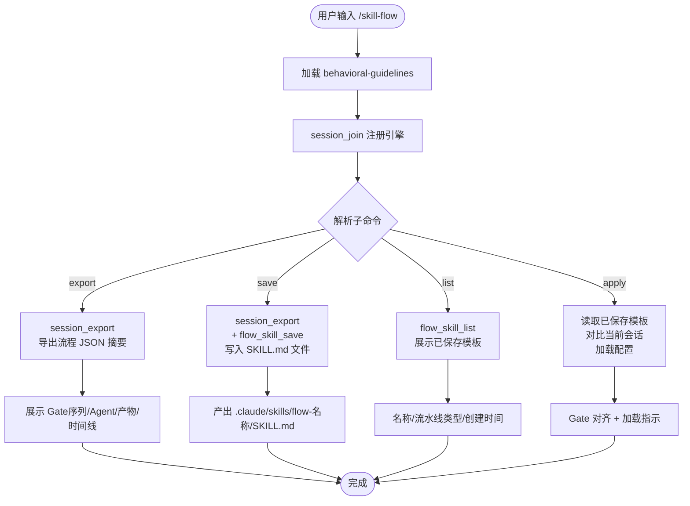

# `/skill-flow` — 会话流程 Skill 化

- **命令**：`/skill-flow [子命令: export|save|list|apply] [名称]`
- **类别**：流程管理
- **说明**：将当前会话的流水线流程（Gate序列+Agent spawn记录+产物引用）导出为可复用的 Skill 模板，实现"一次执行、永久复用"。

## 使用场景

| 场景 | 子命令 | 说明 |
|------|--------|------|
| 查看当前会话流程结构 | `export` | 导出 JSON 摘要，只读不修改 |
| 保存为可复用模板 | `save <名称>` | 导出并保存到 `.claude/skills/flow-<名称>/` |
| 浏览已保存模板 | `list` | 列出所有已保存的流程 Skill |
| 复用历史流程 | `apply <名称>` | 将已保存模板应用到当前会话 |

## 流程步骤

1. **加载技能 + 注册引擎**：`Skill("behavioral-guidelines")` + `session_join`
2. **识别子命令**：从用户输入解析 export / save / list / apply
3. **执行操作**：
   - `export`：调用 `session_export()` 获取流程 JSON → 展示 Gate序列/Agent记录/产物/时间线
   - `save`：`session_export()` → `flow_skill_save()` → 写入 `.claude/skills/flow-<名称>/SKILL.md`
   - `list`：调用 `flow_skill_list()` 展示已保存模板
   - `apply`：读取已保存 Skill → 对比当前会话 Gate 进度 → 加载配置
4. **产出文件**（save 子命令）：`.claude/skills/flow-<名称>/SKILL.md`

## 关键 Agent

此命令不 spawn Agent。所有操作通过 MCP 工具直接完成：
- `mcp__jarvis-engine__session_export` — 导出流程数据
- `mcp__jarvis-engine__flow_skill_save` — 保存为 Skill 模板
- `mcp__jarvis-engine__flow_skill_list` — 列出已保存模板

