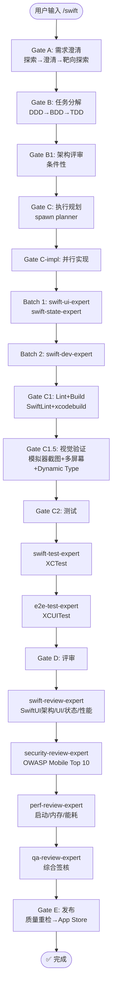

# `/swift` — iOS 原生开发生命周期

- **命令**：`/swift [需求描述]`
- **类别**：框架开发
- **说明**：iOS 原生应用完整开发生命周期，Swift + SwiftUI/UIKit，C1.5 视觉验证强制（含 Dynamic Type）。

## 使用场景
| 场景 | 说明 |
|------|------|
| 原生 iOS 应用开发 | 从零构建 iOS 应用，Swift + SwiftUI |
| 现有 iOS 项目迭代 | 功能新增、Bug 修复、UI 重构 |
| Apple HIG 设计规范实现 | SF Symbols、Dynamic Type、系统手势 |
| iOS 性能优化 | 启动速度、内存、能耗优化 |
| App Store 发布准备 | 签名、TestFlight、审核上架全流程 |

## 关键 Agent
| Agent | 职责 |
|-------|------|
| swift-dev-expert | Swift/SwiftUI 业务逻辑、架构实现 |
| swift-ui-expert | SwiftUI 视图组件、Apple HIG 设计系统 |
| swift-state-expert | Observation/Combine 状态管理 |
| swift-test-expert | XCTest 单元测试 |
| swift-review-expert | SwiftUI 架构/UI/状态/性能评审 |
| e2e-test-expert | XCUITest 端到端测试 |
| security-review-expert | OWASP Mobile Top 10 安全审查 |
| perf-review-expert | 启动/内存/能耗性能分析 |
| qa-review-expert | 综合质量签核 |
| infra-deploy-expert | CI/CD 与 App Store 发布 |

## 质量工具链
- **Lint**: SwiftLint
- **Build**: xcodebuild
- **Test**: XCTest
- **Preview**: SwiftUI Preview + Simulator

## 流程图

