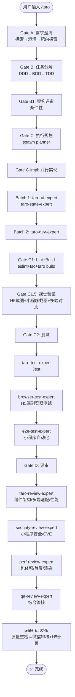

# `/taro` — Taro 小程序/H5 开发生命周期

- **命令**：`/taro [需求描述]`
- **类别**：平台开发
- **说明**：Taro 跨端小程序 + H5 完整开发生命周期，React/Vue + Taro UI，一套代码覆盖微信/支付宝/H5 等多端。

## 使用场景
| 场景 | 说明 |
|------|------|
| 小程序开发 | 微信/支付宝/百度等小程序原生能力调用 |
| H5 移动端页面 | 移动端 Web 页面，Taro 编译为 H5 |
| 多端统一开发 | 一套代码同时输出小程序 + H5 |
| 小程序性能优化 | 包体积、首屏渲染、分包加载优化 |
| 小程序发布准备 | 微信审核 + H5 部署 |

## 关键 Agent
| Agent | 职责 |
|-------|------|
| taro-dev-expert | Taro 业务逻辑、多端架构实现 |
| taro-ui-expert | Taro UI 组件、多端样式适配 |
| taro-state-expert | 状态管理（Redux/MobX） |
| taro-test-expert | Jest 单元测试 |
| taro-review-expert | 组件架构/多端适配/性能评审 |
| e2e-test-expert | 小程序自动化端到端测试 |
| security-review-expert | 小程序安全/CVE 安全审查 |
| perf-review-expert | 包体积/首屏/渲染性能分析 |
| qa-review-expert | 综合质量签核 |
| infra-deploy-expert | 微信审核 + H5 部署发布 |

## 流程图

