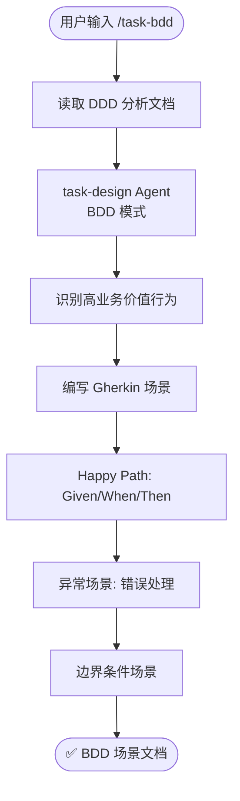

# `/task-bdd` — 行为驱动开发任务分解

- **命令**：`/task-bdd [需求文档路径]`
- **类别**：任务设计
- **说明**：基于 BDD（行为驱动开发）方法论，将需求分解为可验证的行为场景。读取 DDD 分析文档后，由 task-design Agent 以 BDD 模式识别高业务价值行为，输出 Gherkin 格式场景文档，覆盖 Happy Path、异常和边界条件。

## 使用场景

| 场景 | 说明 |
|------|------|
| 需求行为建模 | 将业务需求转化为 Given/When/Then 格式的可执行场景 |
| 验收标准定义 | 为用户故事编写明确的验收条件，确保开发与测试对齐 |
| 异常路径梳理 | 系统性识别错误处理和边界条件场景 |
| 与 TDD 衔接 | 产出的 BDD 场景作为 TDD 任务分解的输入源 |

## 关键 Agent

| Agent | 职责 |
|-------|------|
| task-design (BDD) | 以行为驱动模式分析需求，生成 Gherkin 场景文档 |

## 流程图

