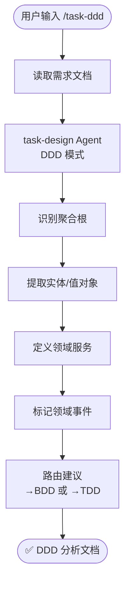

# `/task-ddd` — 领域驱动设计分析

- **命令**：`/task-ddd [需求文档路径]`
- **类别**：任务设计
- **说明**：基于 DDD（领域驱动设计）方法论，对业务领域进行建模分析。由 task-design Agent 以 DDD 模式识别聚合根、实体、值对象和领域事件，输出领域分析文档，并给出后续路由建议（转 BDD 或 TDD）。

## 使用场景

| 场景 | 说明 |
|------|------|
| 领域建模 | 从业务需求中识别聚合根、实体和值对象，建立领域模型 |
| 边界上下文划分 | 明确领域边界，定义领域服务和领域事件 |
| 架构设计前置 | 在编码前完成领域分析，指导后续任务分解方向 |
| 流程路由决策 | 分析完成后推荐走 BDD 场景编写或 TDD 任务分解路径 |

## 关键 Agent

| Agent | 职责 |
|-------|------|
| task-design (DDD) | 以领域驱动模式分析需求，输出聚合根、实体、领域事件等分析文档 |

## 流程图

