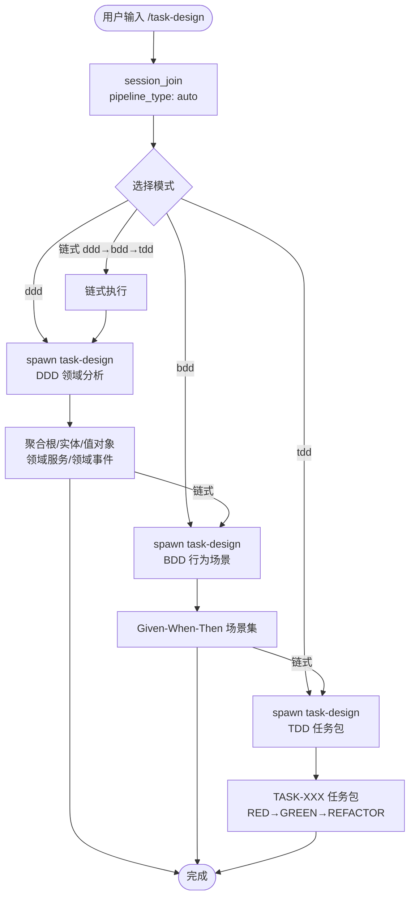

# `/task-design` — 任务分解设计

- **命令**：`/task-design [--mode ddd|bdd|tdd] [需求文档路径]`
- **类别**：流程管理
- **说明**：三模式任务分解——DDD 领域驱动分析、BDD 行为场景生成、TDD 任务包生成。可独立使用或链式执行（ddd→bdd→tdd）。

## 使用场景

| 场景 | 模式 | 说明 |
|------|------|------|
| 领域建模 | `ddd` | 从需求文档提取聚合根/实体/值对象/领域服务/领域事件 |
| 验收场景编写 | `bdd` | 从 DDD 输出或需求文档生成 Given-When-Then 场景 |
| 开发任务包生成 | `tdd` | 从 BDD 场景生成 TASK-XXX 任务包（RED/GREEN/REFACTOR） |
| 全链路分解 | 链式 | ddd→bdd→tdd，完整领域→行为→任务三级分解 |

## 流程步骤

1. **加载技能 + 注册引擎**：`session_join(pipeline_type: "auto")`
2. **模式选择**：从 `--mode` 参数或自动判断（ddd/bdd/tdd）
3. **Spawn Agent**：
   - ddd 模式：spawn `task-designer`（DDD 模式）→ 产出领域模型
   - bdd 模式：spawn `task-designer`（BDD 模式）→ 产出 Gherkin 场景
   - tdd 模式：spawn `task-designer`（TDD 模式）→ 产出 TASK-XXX 任务包
4. **产出文档**：存入 `.jarvis/YYYY-MM-DD/` 对应子目录

## 关键 Agent

| Agent | 模式 | 产出 |
|-------|------|------|
| task-design (DDD) | `ddd` | 聚合根/实体/值对象/领域服务/领域事件 |
| task-design (BDD) | `bdd` | Given-When-Then 场景集 |
| task-design (TDD) | `tdd` | TASK-XXX 任务包 (RED→GREEN→REFACTOR) |

子流程文档：
- `task-bdd` — BDD 行为驱动场景生成详细流程
- `task-ddd` — DDD 领域驱动分析详细流程
- `task-tdd` — TDD 测试驱动任务分解详细流程

