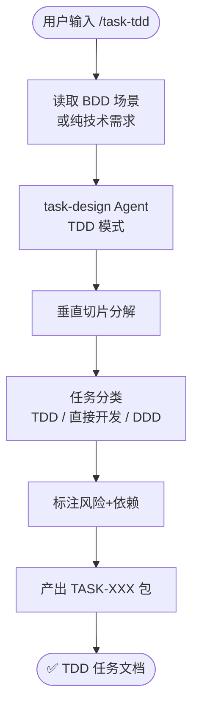

# `/task-tdd` — 测试驱动开发任务分解

- **命令**：`/task-tdd [需求文档路径]`
- **类别**：任务设计
- **说明**：基于 TDD（测试驱动开发）方法论，将需求分解为可测试的垂直切片任务。读取 BDD 场景或纯技术需求后，由 task-design Agent 以 TDD 模式进行任务分类（TDD / 直接开发 / DDD），标注风险与依赖，输出 TASK-XXX 任务包。

## 使用场景

| 场景 | 说明 |
|------|------|
| 任务切片分解 | 将需求按垂直切片拆分为独立可交付的开发任务 |
| 测试优先规划 | 以测试先行的方式规划开发任务，确保每个任务有明确的验证标准 |
| 风险与依赖标注 | 识别任务间依赖关系和潜在风险，辅助排期决策 |
| 与 BDD 衔接 | 接收 BDD 场景文档作为输入，转化为可执行的开发任务 |

## 关键 Agent

| Agent | 职责 |
|-------|------|
| task-design (TDD) | 以测试驱动模式分解任务，输出含风险和依赖标注的任务包 |

## 流程图

