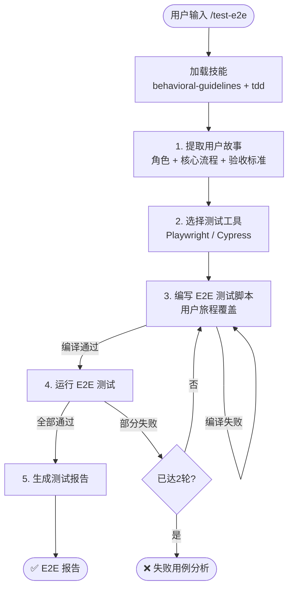

# `/test-e2e` — 端到端测试

- **命令**：`/test-e2e [用户故事/功能模块]`
- **类别**：测试
- **说明**：从用户故事中提取角色、核心流程和验收标准，选择 Playwright 或 Cypress 编写端到端测试脚本，覆盖关键用户旅程，失败时自动重试并生成报告。

## 使用场景

| 场景 | 说明 |
|------|------|
| 核心用户旅程验证 | 覆盖登录、支付、注册等关键业务流程 |
| 发布前回归 | 上线前对主要功能做端到端回归验证 |
| 新功能验收 | 新功能开发完成后验证用户故事的验收标准 |
| 跨页面交互测试 | 验证多页面、多步骤的复杂交互流程 |

## 关键 Agent

| Agent | 职责 |
|-------|------|
| e2e-test-expert | 设计端到端测试方案并编写测试脚本 |
| browser-test-expert | 操作浏览器自动化工具执行和调试测试 |

## 流程图

