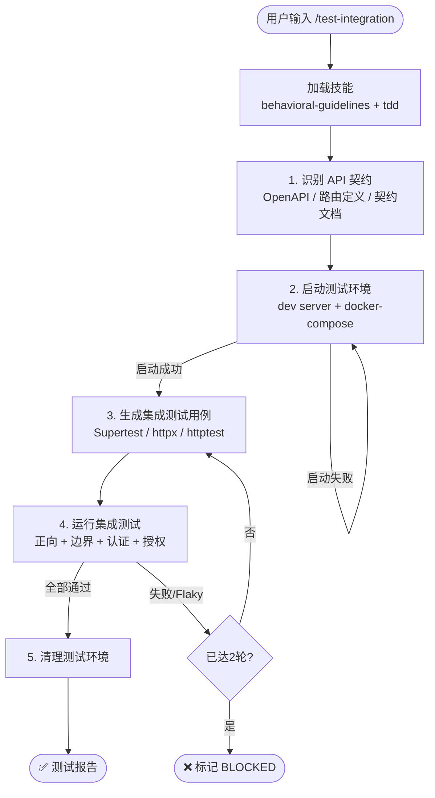

# `/test-integration` — 集成测试 / API 测试

- **命令**：`/test-integration [API/服务/模块]`
- **类别**：测试
- **说明**：识别 API 契约（OpenAPI / 路由定义），启动测试环境，生成覆盖正向、边界、认证和授权场景的集成测试用例，失败或 Flaky 时自动重试。

## 使用场景

| 场景 | 说明 |
|------|------|
| API 契约验证 | 验证接口实现与 OpenAPI/路由定义的一致性 |
| 服务间集成 | 测试多个服务或模块之间的交互和数据流 |
| 认证授权测试 | 验证接口的认证和授权机制是否正确 |
| 数据库集成 | 验证业务逻辑与数据库的交互是否符合预期 |

## 关键 Agent

| Agent | 职责 |
|-------|------|
| api-test-expert | 设计 API 测试方案，生成接口测试用例 |
| backend-test-expert | 编写后端服务集成测试 |
| frontend-test-expert | 编写前端与后端的集成测试 |

## Gate 引擎集成

立即执行以下初始化步骤：

1. 注册引擎会话：
   - `mcp__jarvis-engine__session_join({ platform: "claude", pipeline_type: "auto" })`
   - `mcp__jarvis-engine__pipeline_guide()` 获取当前 Gate 允许的操作
2. 测试执行前调用 `mcp__jarvis-engine__gate_check({ operation: "spawn_test" })`
3. 测试完成后调用 `mcp__jarvis-engine__gate_enforce()` 验证 Gate 条件
4. `mcp__jarvis-engine__advance_gate()` 推进到下一个 Gate

## 流程图

