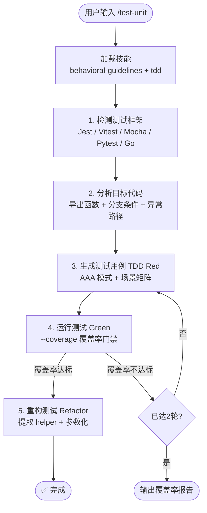

# `/test-unit` — 单元测试生成

- **命令**：`/test-unit [目标文件/模块]`
- **类别**：测试
- **说明**：自动检测测试框架，分析目标代码的导出函数、分支条件和异常路径，按 TDD Red-Green-Refactor 循环生成单元测试，覆盖率不达标时自动重试。

## 使用场景

| 场景 | 说明 |
|------|------|
| 新模块补测试 | 为已有业务模块生成完整的单元测试套件 |
| 覆盖率提升 | 针对低覆盖率文件补充测试用例，达到门禁阈值 |
| 回归防护 | 重构前为关键函数生成测试，确保行为不变 |
| TDD 驱动开发 | 先写测试再实现，驱动设计和实现 |

## 关键 Agent

| Agent | 职责 |
|-------|------|
| test-executor | 执行测试生成、运行和覆盖率分析 |
| test-doc-writer | 生成测试报告和文档 |

## 流程图

