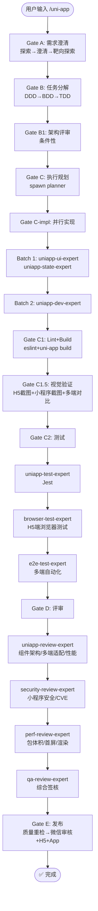

# `/uni-app` — uni-app 跨端开发生命周期

- **命令**：`/uni-app [需求描述]`
- **类别**：框架开发
- **说明**：uni-app 跨端应用完整开发生命周期，Vue + uni-ui，一套代码覆盖微信/支付宝/H5/App 等多端。

## 使用场景
| 场景 | 说明 |
|------|------|
| uni-app 跨端开发 | 一套代码同时输出小程序 + H5 + App |
| 现有 uni-app 项目迭代 | 功能新增、Bug 修复、组件重构 |
| 多端适配 | 条件编译、平台差异化处理 |
| uni-app 性能优化 | 包体积、首屏渲染、分包加载优化 |
| 多平台发布准备 | 微信审核 + H5 部署 + App 打包 |

## 关键 Agent
| Agent | 职责 |
|-------|------|
| uniapp-dev-expert | uni-app 业务逻辑、多端架构实现 |
| uniapp-ui-expert | uni-ui 组件、多端样式适配 |
| uniapp-state-expert | Vuex/Pinia 状态管理 |
| uniapp-test-expert | Jest + uni-app 测试 |
| uniapp-review-expert | 组件架构/多端适配/性能评审 |
| e2e-test-expert | uni-app 自动化端到端测试 |
| security-review-expert | 小程序安全/CVE 安全审查 |
| perf-review-expert | 包体积/首屏/渲染性能分析 |
| qa-review-expert | 综合质量签核 |
| infra-deploy-expert | 微信审核 + H5 + App 发布 |

## 质量工具链
- **Lint**: eslint
- **Build**: uni-app build
- **Test**: Jest
- **Preview**: HBuilderX + 微信开发者工具

## 流程图

