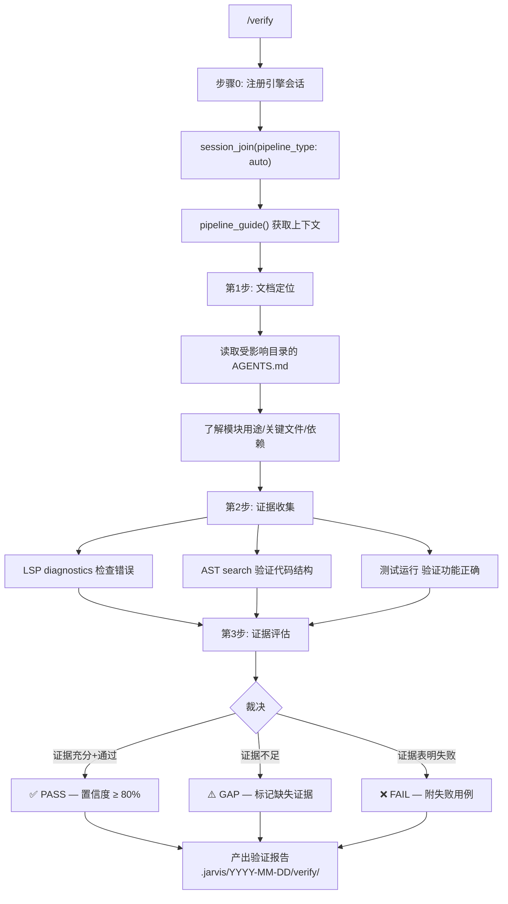

# `/verify` — 文档驱动验证

> 基于项目 AGENTS.md 层级文档，收集证据确认改动生效可用

## 验证维度

| 维度 | 检查方式 | 工具 |
|------|---------|------|
| 代码正确性 | LSP diagnostics | `jarvis_lsp_diagnostics` |
| 结构一致性 | AST 模式匹配 | `jarvis_ast_search` |
| 功能正确性 | 测试套件 | Bash + vitest |
| 引用完整性 | LSP findReferences | `jarvis_lsp_find_references` |
| 文档覆盖率 | AGENTS.md 对比 | Read + Grep |
