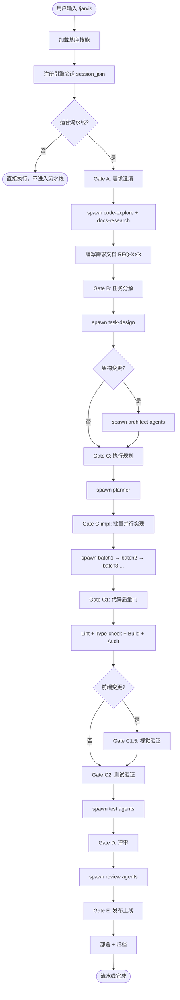

# 任务分解：主题默认化 + Artifacts 数据库隔离 + Bug 修复 + 文档更新

**日期**：2026-05-10
**关联需求文档**：`docs/requirements/2026-05-10-theme-default-artifacts-isolation.md`
**需求覆盖**：REQ-025 ~ REQ-031

---

## 任务概览

| TASK | 关联 REQ | 名称 | 类型 | 优先级 | 粒度 | 风险 |
|------|---------|------|------|--------|------|------|
| TASK-001 | REQ-025 | 替换主题为 antd 显式 token 配置 | 直接开发 | P0 | S | 低 |
| TASK-002 | REQ-026 | 新增 artifacts 数据库表与 CRUD | DDD | P0 | M | 中 |
| TASK-003 | REQ-026 | 自动记录 artifact + 重构 findSessionGateArtifacts | DDD | P0 | M | 中 |
| TASK-004 | REQ-027 | 会话列表操作乐观更新 + 回滚 | TDD | P0 | M | 中 |
| TASK-005 | REQ-028 | 修复 MD 预览抽屉 resizable | 直接开发 | P1 | XS | 低 |
| TASK-006 | REQ-029 | 更新 README（平台范围 + 产物目录规范） | 直接开发 | P1 | XS | 低 |
| TASK-007 | REQ-029 | 更新 AGENTS.md + CLAUDE.md | 直接开发 | P1 | XS | 低 |
| TASK-008 | REQ-030 | 创建 16 个 Mermaid 命令流程图 | 直接开发 | P1 | XL | 中 |
| TASK-009 | REQ-031 | 清理旧数据库 + 全局重装 | 直接开发 | P2 | XS | 低 |

---

## 任务分解列表

---

### TASK-001：替换主题为 antd 显式 token 配置

- **任务 ID**：TASK-001
- **关联需求**：REQ-025
- **类型**：直接开发
- **优先级**：P0
- **预估变更行数**：S（~55 行）
- **完成标准**：
  1. `ConfigProvider` 使用显式 token 而非仅 `defaultAlgorithm`
  2. 主色为蓝色 `#1677ff`，成功 `#52c41a`，警告 `#faad14`，错误 `#ff4d4f`
  3. 圆角 `borderRadius: 6`，各级别 XS=2 / SM=4 / LG=8
  4. 间距体系 padding/margin：16/12/24
  5. 阴影使用 antd 默认 boxShadow 值（`0 2px 8px rgba(0,0,0,0.15)` 等）
  6. 所有页面（Dashboard/Agents/Archive）视觉正常，无样式错乱
  7. 移除不再需要的旧主题相关代码
- **文件所有权**：
  | 文件 | 操作 |
  |------|------|
  | `web/src/theme.tsx` | **重写** — 替换为显式 token 配置 |
  | `web/src/App.tsx` | **review** — 确认 `{...defaultTheme}` 展开方式仍兼容 |
- **共享区域冲突检查**：无冲突。`theme.tsx` 仅被 `App.tsx` 引用，`App.tsx` 仅被此任务修改。
- **并行分组**：Group A（与 TASK-004, TASK-005, TASK-007 并行）

**实现指引**：

```tsx
// web/src/theme.tsx 目标结构
import type { ConfigProviderProps } from 'antd';

const defaultTheme: ConfigProviderProps = {
  theme: {
    token: {
      colorPrimary: '#1677ff',
      colorSuccess: '#52c41a',
      colorWarning: '#faad14',
      colorError: '#ff4d4f',
      borderRadius: 6,
      borderRadiusXS: 2,
      borderRadiusSM: 4,
      borderRadiusLG: 8,
      paddingSM: 12,
      padding: 16,
      paddingLG: 24,
      marginSM: 12,
      margin: 16,
      marginLG: 24,
      boxShadow: '0 2px 8px rgba(0, 0, 0, 0.15)',
      boxShadowSecondary: '0 4px 12px rgba(0, 0, 0, 0.1)',
    },
  },
};

export default defaultTheme;
```

---

### TASK-002：新增 artifacts 数据库表与 CRUD 函数

- **任务 ID**：TASK-002
- **关联需求**：REQ-026
- **类型**：DDD（数据模型设计 — 聚合边界：产物归属 run，唯一约束防重复）
- **优先级**：P0
- **预估变更行数**：M（~80 行）
- **完成标准**：
  1. `artifacts` 表在 `initSchema` 中自动创建，含字段 id / run_id / gate / filepath / created_at
  2. 唯一约束 `UNIQUE(run_id, gate, filepath)` 生效，重复插入静默忽略
  3. 导出 `insertArtifact(db, runId, gate, filepath)` — INSERT OR IGNORE
  4. 导出 `getArtifactsByRun(db, runId)` — 获取某 run 的所有产物
  5. 导出 `getArtifactsByRunAndGate(db, runId, gate)` — 按 run+gate 精确查询
  6. 引擎启动时建表不报错
- **文件所有权**：
  | 文件 | 操作 |
  |------|------|
  | `src/engine/db.ts` | **修改** — `initSchema` 新增 CREATE TABLE artifacts；新增 3 个导出函数 |
- **共享区域冲突检查**：**串行依赖**。`db.ts` 是核心共享区域，TASK-003 依赖本章的表结构。本章需先完成。
- **并行分组**：Group B-1（TASK-003 的前置）

**DDD 说明**：
- **聚合根**：`pipeline_runs` — 一次 run 是一个完整的流水线执行，产物归属于 run
- **值对象**：artifact（不可变 — 记录后不改动，仅创建和查询）
- **唯一约束**：`(run_id, gate, filepath)` 确保同一 run 同一 gate 的同一文件不会重复记录

---

### TASK-003：自动记录 artifact + 重构 findSessionGateArtifacts

- **任务 ID**：TASK-003
- **关联需求**：REQ-026
- **类型**：DDD（领域服务 — Gate 推进时自动扫描产物目录 + 一致性查询）
- **优先级**：P0
- **预估变更行数**：M（~90 行）
- **依赖**：TASK-002（需要 artifacts 表的 CRUD 函数）
- **完成标准**：
  1. `advance_gate` MCP 工具在推进 Gate 后，自动扫描 `docs/{gate_subdir}/` 新增 .md 文件并写入 artifacts 表
  2. `findSessionGateArtifacts` 优先查询 artifacts 表（`SELECT filepath FROM artifacts WHERE run_id = ? AND gate = ?`）
  3. 无 artifacts 记录时回退到日期前缀匹配（向后兼容旧数据）
  4. 不同 session 在同一天的产物不再互相污染
  5. REST API `/api/pipeline` 返回的 artifacts 准确反映当前 run 的产出
- **文件所有权**：
  | 文件 | 操作 |
  |------|------|
  | `src/engine/gates.ts` | **修改** — `findSessionGateArtifacts` 新增 `runId` 参数，优先 DB 查询，回退日期匹配 |
  | `src/engine/server.ts` | **修改** — `advance_gate` 工具在 checkpoint 记录后扫描并写入 artifacts |
  | `src/web/routes.ts` | **review/微调** — `/api/pipeline` handler 传递 `run.id` 给 `findSessionGateArtifacts` |
- **共享区域冲突检查**：
  - `gates.ts` 与 server.ts 无直接冲突（`findSessionGateArtifacts` 被 routes.ts 调用，路由层不修改）
  - `server.ts` 与 `gates.ts` 互不冲突
  - `routes.ts` 变更极小（增加 1 个参数传递）
  - **无外部任务冲突**，但本章依赖 TASK-002 的 DB 函数
- **并行分组**：Group B-2（依赖 TASK-002 完成）

**DDD 说明**：
- `advance_gate` 是领域服务：Gate 推进时，自动同步产物目录状态到数据库
- `findSessionGateArtifacts` 是查询服务：优先精确查询（DB），回退模糊查询（日期匹配）
- 向后兼容策略：旧 run 无 artifacts 记录 → 静默回退到日期匹配 → 后续新 run 自动使用精确查询

**实现指引**：

```ts
// gates.ts — 函数签名变更
export function findSessionGateArtifacts(docsDir, gate, sessionId, db, runId?) {
  const subdir = GATE_DIRS[gate];
  if (!subdir) return [];

  // 优先：DB 精确查询（新数据）
  if (runId) {
    const rows = db.prepare(
      'SELECT filepath FROM artifacts WHERE run_id = ? AND gate = ? ORDER BY created_at'
    ).all(runId, gate);
    if (rows.length > 0) return rows.map(r => r.filepath).slice(0, 5);
  }

  // 回退：日期前缀匹配（旧数据兼容）
  const checkpoints = db.prepare(
    'SELECT passed_at FROM checkpoints WHERE session_id = ? AND gate = ?'
  ).all(sessionId, gate);
  // ... 原有日期匹配逻辑 ...
}
```

```ts
// server.ts — advance_gate 末尾新增 artifact 记录
// 在 addCheckpoint / updatePipelineGate 之后：
if (runId && gate) {
  const subdir = GATE_DIRS[gate];
  if (subdir) {
    const dir = join(root, 'docs', subdir);
    if (existsSync(dir)) {
      const mdFiles = readdirSync(dir).filter(f => f.endsWith('.md'));
      for (const f of mdFiles) {
        insertArtifact(db, runId, gate, f);
      }
    }
  }
}
```

---

### TASK-004：会话列表操作乐观更新 + 回滚

- **任务 ID**：TASK-004
- **关联需求**：REQ-027
- **类型**：TDD（状态管理 — 乐观更新/SSE 覆盖/失败回滚，涉及异步竞态和错误恢复）
- **优先级**：P0
- **预估变更行数**：M（~60 行）
- **完成标准**：
  1. 置顶后列表立即重新排序（置顶项移到顶部），不等待 SSE 推送
  2. 归档后列表项立即从会话列表消失
  3. 删除后列表项立即消失
  4. SSE 推送到达时覆盖本地状态（最终一致性，防止乐观更新与真实数据不一致）
  5. API 调用失败时回滚本地状态到操作前，并显示错误提示
  6. 短时间内连续操作不会产生竞态冲突
- **文件所有权**：
  | 文件 | 操作 |
  |------|------|
  | `web/src/components/Layout.tsx` | **修改** — `handlePin`, `handleArchive`, `handleDelete` 增加乐观更新逻辑 |
- **共享区域冲突检查**：无冲突。`Layout.tsx` 仅被此任务修改。
- **并行分组**：Group A（与 TASK-001, TASK-005, TASK-007 并行）
- **test_strategy**：tdd

**TDD 测试用例**（先写测试，确认失败后再实现）：

```ts
// 测试用例 1: 乐观置顶后列表立即重排序
// 1. 初始状态：[A(未置顶), B(未置顶), C(已置顶)]
// 2. 点击置顶 A → 期望：[A(已置顶), C(已置顶), B(未置顶)]
// 3. 不等待 SSE

// 测试用例 2: API 失败时回滚
// 1. Mock api.pinRun 返回 { ok: false }
// 2. 点击置顶 A → 期望：状态回滚，显示错误提示

// 测试用例 3: SSE 覆盖乐观状态
// 1. 乐观置顶 A → 列表立即更新
// 2. SSE 推送到达（服务端真实状态）→ 覆盖本地，不再闪烁
```

**实现指引**（Layout.tsx 修改要点）：

```tsx
// handlePin: 乐观更新示例
const handlePin = useCallback(async (runId: string, pinned: boolean) => {
  // 1. 保存旧状态快照
  const prev = sessions;

  // 2. 乐观更新
  setSessions(prev => prev.map(s =>
    s.run_id === runId ? { ...s, pinned: pinned ? 0 : 1 } : s
  ));

  try {
    const r = pinned ? await api.unpinRun(runId) : await api.pinRun(runId);
    if (!r.ok) throw new Error('操作失败');
    message.success(pinned ? '已取消置顶' : '已置顶');
  } catch {
    // 3. 失败回滚
    setSessions(prev);
    message.error('操作失败，请重试');
  }
}, []);

// SSE onmessage 保持不变，覆盖本地状态实现最终一致性
```

---

### TASK-005：修复 MD 预览抽屉 resizable 不工作

- **任务 ID**：TASK-005
- **关联需求**：REQ-028
- **类型**：直接开发
- **优先级**：P1
- **预估变更行数**：XS（~5 行）
- **完成标准**：
  1. 抽屉左边缘出现可拖拽手柄
  2. 拖拽可在 380px ~ 900px 范围内调整宽度
  3. 拖拽过程中内容正常渲染（Markdown 懒加载不会闪烁/崩溃）
  4. `size` 属性不与 `resizable` 冲突（antd v6 中前者为默认尺寸，后者为可调范围）
- **文件所有权**：
  | 文件 | 操作 |
  |------|------|
  | `web/src/pages/Dashboard.tsx` | **修改** — Drawer 组件添加 `minWidth`/`maxWidth` 属性 |
- **共享区域冲突检查**：无冲突。`Dashboard.tsx` 仅被此任务修改。
- **并行分组**：Group A（与 TASK-001, TASK-004, TASK-007 并行）

**实现指引**：

当前代码（Dashboard.tsx 第 435-441 行）：
```tsx
<Drawer
  title={...}
  open={docDrawer.open}
  onClose={...}
  size={560}
  resizable
  styles={{ body: { background: '#FFF9F0' } }}
>
```

修改后：
```tsx
<Drawer
  title={...}
  open={docDrawer.open}
  onClose={...}
  size={560}
  resizable
  minWidth={380}
  maxWidth={900}
  styles={{ body: { background: '#FFF9F0' } }}
>
```

**antd v6 注意**：`resizable` 在 antd v6.3.x 中需要 `minWidth`/`maxWidth` 配合才能显式约束拖拽范围。如果拖拽手柄不出现，检查 CSS — 可能需要确保 `.ant-drawer-body` 的 overflow 不阻断鼠标事件。

---

### TASK-006：更新 README.md（平台范围 + 产物目录规范）

- **任务 ID**：TASK-006
- **关联需求**：REQ-029
- **类型**：直接开发（文档）
- **优先级**：P1
- **预估变更行数**：XS（~30 行）
- **完成标准**：
  1. README 明确声明当前只维护 Claude Code 平台
  2. 说明 OpenCode/Codex 暂不维护，后续按需启动
  3. 产物目录规范明确：临时产物 `docs/tmp/*`，智能产出 `docs/*`，临时文档 `docs/tmp/*`
  4. 关键约束项已包含目录规范（与 AGENTS.md 一致）
- **文件所有权**：
  | 文件 | 操作 |
  |------|------|
  | `README.md` | **修改** — 新增平台维护声明 + 产物目录规范章节 |
- **共享区域冲突检查**：**串行依赖**。TASK-008 也需要修改 `README.md`（添加流程图链接）。本章需先完成，TASK-008 在此基础上叠加。
- **并行分组**：Group C-1（TASK-008 的前置）

**修改要点**：
1. 在"核心特性"或"架构"章节前新增"平台维护状态"小节
2. 在架构图下方新增"产物目录规范"小节
3. 可同步更新 README badge 上的跨平台描述措辞

---

### TASK-007：更新 AGENTS.md + CLAUDE.md

- **任务 ID**：TASK-007
- **关联需求**：REQ-029
- **类型**：直接开发（文档）
- **优先级**：P1
- **预估变更行数**：XS（~20 行）
- **完成标准**：
  1. AGENTS.md 关键约束中新增：OpenCode/Codex 不做同步修改优化，除非用户明确说明要开始做
  2. AGENTS.md 明确产物目录规范（智能体产出路径规则，与 README 一致）
  3. CLAUDE.md 如需要同步更新
- **文件所有权**：
  | 文件 | 操作 |
  |------|------|
  | `AGENTS.md` | **修改** — 关键约束新增 2 条 |
  | `CLAUDE.md` | **review** — 确认是否需要同步更新 |
- **共享区域冲突检查**：无冲突。AGENTS.md 和 CLAUDE.md 仅被此任务修改。
- **并行分组**：Group A（与 TASK-001, TASK-004, TASK-005 并行）

**AGENTS.md 修改要点**（在"关键约束"第 16 条后插入）：

```markdown
16. **OpenCode/Codex 不同步约束** — 不做 OpenCode/Codex 平台的同步修改或优化，除非用户明确说明要开始维护对应平台。
17. **产物目录规范** — 
    - 临时产物统一放入 `docs/tmp/`（截图、快照、验证数据等）
    - 智能体正式产出按 Gate 存入 `docs/{requirements|tasks|architecture|plans|implementation|testing|review|shipping}/`
    - 临时文档统一 `docs/tmp/*`，正式文档 `docs/*`
```

---

### TASK-008：创建 16 个 Mermaid 命令流程图

- **任务 ID**：TASK-008
- **关联需求**：REQ-030
- **类型**：直接开发（文档 + 图表）
- **优先级**：P1
- **预估变更行数**：XL（~520 行，16 个文件 x ~30 行 + README ~20 行）
- **风险等级**：中
- **风险说明**：
  - XL 粒度原因：16 个流程图需要逐一理解各命令的 Gate 序列和 Agent 调度逻辑。**不拆分**的理由：所有流程图需保持一致风格和模板结构，拆分后容易风格不统一；且每个流程图文件独立无代码依赖。
- **完成标准**：
  1. `docs/flows/` 目录下 16 个 `.md` 文件，每个包含完整的 Mermaid 流程图
  2. 每个流程图正确反映该命令的 Gate 序列（含条件性 Gate B1/C1.5 判断）
  3. 每个流程图展示 Agent spawn 关系和并行/串行逻辑
  4. README 中新增"命令流程图"章节，含 16 个链接
- **文件所有权**：
  | 文件 | 操作 |
  |------|------|
  | `docs/flows/jarvis.md` | **新建** |
  | `docs/flows/jarvis-lite.md` | **新建** |
  | `docs/flows/frontend.md` | **新建** |
  | `docs/flows/backend.md` | **新建** |
  | `docs/flows/android.md` | **新建** |
  | `docs/flows/ios.md` | **新建** |
  | `docs/flows/flutter.md` | **新建** |
  | `docs/flows/expo.md` | **新建** |
  | `docs/flows/taro.md` | **新建** |
  | `docs/flows/browser-test.md` | **新建** |
  | `docs/flows/bug-fix.md` | **新建** |
  | `docs/flows/review.md` | **新建** |
  | `docs/flows/review-fix.md` | **新建** |
  | `docs/flows/frontend-architect.md` | **新建** |
  | `docs/flows/backend-architect.md` | **新建** |
  | `docs/flows/algorithm-expert.md` | **新建** |
  | `README.md` | **修改** — 新增"命令流程图"章节 + 16 个链接 |
- **共享区域冲突检查**：**串行依赖**。`README.md` 同时被 TASK-006 和本任务修改。TASK-006 需先完成结构调整，本任务在此基础上添加链接。
- **并行分组**：Group C-2（依赖 TASK-006）

**Mermaid 流程图模板**（以 jarvis.md 为例）：



---

### TASK-009：清理旧数据库 + 全局重装

- **任务 ID**：TASK-009
- **关联需求**：REQ-031
- **类型**：直接开发（运维操作）
- **优先级**：P2
- **预估变更行数**：XS（无代码修改）
- **完成标准**：
  1. 引擎已停止
  2. 旧数据库 `~/.jarvis/engine.db` 已删除（含 WAL/SHM 辅助文件）
  3. 全局安装新版：`npm install -g .` 成功
  4. 工作区依赖更新：`npm ci` 成功
  5. 引擎重启后侧边栏会话数为 0（新数据库）
- **文件所有权**：无代码文件修改
- **共享区域冲突检查**：无冲突（纯运维操作，不涉及代码）
- **并行分组**：Group D（完全独立，任意时刻可执行）

**运维步骤**：

```bash
# 1. 停止引擎
jarvis engine stop

# 2. 删除旧数据库
rm -f ~/.jarvis/engine.db ~/.jarvis/engine.db-wal ~/.jarvis/engine.db-shm

# 3. 全局重装
npm install -g .

# 4. 更新工作区依赖
npm ci

# 5. 重启引擎
jarvis engine start
```

**注意事项**：
- 数据库删除不可逆，确认无重要历史数据后再执行
- 如需保留旧数据，先备份：`cp ~/.jarvis/engine.db ~/.jarvis/engine.db.bak`
- WAL/SHM 文件是 SQLite WAL 模式的附属文件，必须一并删除

---

## DDD 分类

| TASK | 分类理由 |
|------|---------|
| TASK-002 | 数据模型设计 — artifacts 表作为 pipeline_runs 的子聚合，唯一约束防重复，需定义聚合边界和一致性规则 |
| TASK-003 | 领域服务 — advance_gate 推进时自动扫描产物目录 → 写 artifacts 表（两个聚合间的状态同步）；findSessionGateArtifacts 是查询策略（DB 精确 + 日期匹配回退） |

## TDD 与直接开发分类

| TASK | 分类 | 理由 |
|------|------|------|
| TASK-004 | **TDD** | 乐观更新/SSE 覆盖/失败回滚涉及状态竞态、异步错误恢复、边界条件（连续快速操作）。必须先写测试覆盖这些场景。 |
| TASK-001 | 直接开发 | 纯配置替换，无业务逻辑。验证：视觉检查 + antd ConfigProvider 渲染正常 |
| TASK-005 | 直接开发 | 单属性修复，无逻辑分支。验证：拖拽手柄可见 + 宽度范围正确 |
| TASK-006 | 直接开发 | 纯文档，无代码逻辑 |
| TASK-007 | 直接开发 | 纯文档，无代码逻辑 |
| TASK-008 | 直接开发 | 纯文档/图表，无代码逻辑。验证：Mermaid 正确渲染 |
| TASK-009 | 直接开发 | 纯运维操作，无代码修改 |

## 风险任务

| TASK | 风险等级 | 风险原因 | 缓解措施 |
|------|---------|---------|---------|
| TASK-002 | 中 | 修改核心共享文件 `db.ts`；新增表结构可能与其他迁移脚本冲突 | 独立建表（IF NOT EXISTS），不修改现有表 |
| TASK-003 | 中 | 依赖 TASK-002；修改 `advance_gate` 核心路径；向后兼容旧数据 | 先 DB 查询后日期回退策略；加 try/catch 防止扫描失败阻塞 Gate 推进 |
| TASK-004 | 中 | 乐观更新涉及异步状态竞态；Layout.tsx 是前端核心组件 | 先写 TDD 测试覆盖边界场景；SSE 覆盖保证最终一致性 |
| TASK-008 | XL | 16 个文件，需要逐一理解每个命令的 Gate 序列和 Agent 调度逻辑；Mermaid 流程图准确性要求高 | 不拆分的理由：所有流程图需保持一致的模板风格；每个文件独立，可逐个创建并对照 `.md` 源文件验证；README 链接在最后统一添加 |

## 文件所有权和共享路径提醒

### 共享区域冲突矩阵

| 文件 | 涉及 TASK | 冲突类型 | 处理方式 |
|------|----------|---------|---------|
| `src/engine/db.ts` | TASK-002 | 独占修改 | TASK-002 完成后 TASK-003 才能使用其导出函数 |
| `src/engine/gates.ts` | TASK-003 | 独占修改 | 无外部冲突 |
| `src/engine/server.ts` | TASK-003 | 独占修改 | 无外部冲突 |
| `src/web/routes.ts` | TASK-003 | 极小修改 | 仅传参调整，无外部冲突 |
| `README.md` | TASK-006, TASK-008 | **串行冲突** | TASK-006 先完成结构调整 → TASK-008 在此基础上添加链接 |
| `web/src/theme.tsx` | TASK-001 | 独占修改 | 无外部冲突 |
| `web/src/App.tsx` | TASK-001 | 独占修改 | 无外部冲突 |
| `web/src/components/Layout.tsx` | TASK-004 | 独占修改 | 无外部冲突 |
| `web/src/pages/Dashboard.tsx` | TASK-005 | 独占修改 | 无外部冲突 |
| `AGENTS.md` | TASK-007 | 独占修改 | 无外部冲突 |
| `CLAUDE.md` | TASK-007 | 独占修改 | 无外部冲突 |
| `docs/flows/*.md` | TASK-008 | 独占创建 | 16 个新文件，不冲突 |

## 推荐交付顺序

### 并行分组图

```
Round 1 ─────────────────────────────────────────────────────
│                                                             │
│  Group A (并行)              Group B (串行)                  │
│  ├── TASK-001 (主题)         TASK-002 ──→ TASK-003          │
│  ├── TASK-004 (乐观更新)     (artifacts 表 → 重构查询)       │
│  ├── TASK-005 (resizable)                                   │
│  └── TASK-007 (AGENTS)                                      │
│                                                             │
│  Group C (串行)              Group D (独立)                  │
│  TASK-006 ──→ TASK-008      TASK-009 (随时可做)             │
│  (README → 流程图)                                          │
│                                                             │
└─────────────────────────────────────────────────────────────
```

### 推荐顺序

| 顺序 | TASK | 理由 |
|------|------|------|
| 1 | TASK-001 | P0，独立，风险低，视觉验证快 |
| 2 | TASK-002 | P0，DB 变更优先做，减少后续迁移风险 |
| 3 | TASK-003 | P0，依赖 TASK-002，artifact 隔离是核心需求 |
| 4 | TASK-004 | P0，独立，但需要 TDD 测试先写 |
| 5 | TASK-005 | P1，独立，XS 快速修复 |
| 6 | TASK-006 | P1，独立文档，为 TASK-008 铺路 |
| 7 | TASK-007 | P1，独立文档，可与 TASK-006 并行 |
| 8 | TASK-008 | P1，依赖 TASK-006（README 结构稳定后再加链接） |
| 9 | TASK-009 | P2，运维操作，最后执行（确保所有代码变更已完成并安装） |

## 推荐的下一步

1. **planner** 读取本任务文档，按上述并行分组编排执行计划
2. **TASK-004 (TDD)** 在实现前先编写测试用例，确认失败后再实现
3. **TASK-002 / TASK-003 (DDD)** 先确认 artifacts 表的聚合边界设计无争议，再动手实现
4. **TASK-008 (XL)** 建议按命令类别分批创建：先完成核心编排类（jarvis/jarvis-lite），再完成开发生命周期类，最后完成审查/专家类

---

*任务分解完成，可交付给 planner 做执行编排。*
